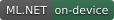

<div dir="rtl">

<p align="center">
  
</p>

<h1 align="center">قیچی</h1>

<p align="center">
  <b>پیامک‌هاتون، بدون مزاحم‌ها.</b><br>
  پیامک‌های تبلیغاتی و ناخواسته روی خود گوشی شناسایی و جدا می‌شن.
</p>

<p align="center">
  <a href="README.en.md">English</a> ·
  <a href="https://github.com/MahdiyarGHD/GheychiApp/releases/latest">دانلود آخرین نسخه</a> ·
  <a href="https://github.com/MahdiyarGHD/sms-spam-dataset">دیتاست و مدل</a>
</p>

<p align="center">
  
  
  
</p>

---

## چرا قیچی؟

هر روز کلی پیامک تبلیغاتی، قرعه‌کشی و پیامک‌های ناخواسته میاد. هر کدوم هم با یه اعلان و صدای جدید حواس آدم رو پرت می‌کنن و بین این همه پیام، پیدا کردن پیام‌های مهم سخت‌تر می‌شه.

قیچی یه برنامه‌ی پیامک کامله که این پیام‌ها رو با هوش مصنوعی **روی خود گوشی** تشخیص می‌ده و بی‌سروصدا می‌فرستتشون توی بخش «هرزنامه».

نه اعلان اضافه‌ای، نه صدای اضافه‌ای.
متن پیام‌هاتون هم برای تشخیص به هیچ سروری فرستاده نمی‌شه.

## ✂️ امکانات اصلی

### تشخیص هرزنامه روی گوشی

* مدل هوش مصنوعی با ML.NET که بدون اینترنت و کاملاً روی خود گوشی اجرا می‌شه.
* هرزنامه‌ها اعلان و صدا ندارن و مزاحم کارتون نمی‌شن.
* سه سطح حساسیت داره: ملایم، متعادل و سخت‌گیر. حتی می‌تونید دقیق‌تر هم تنظیمش کنید.
* پیام مخاطبان ذخیره‌شده هیچ‌وقت بررسی نمی‌شه. فرستنده‌های دیگه رو هم می‌تونید به لیست «مورد اعتماد» اضافه کنید.
* هرزنامه‌های قدیمی بعد از مدتی که خودتون تعیین می‌کنید، خودکار پاک می‌شن.
* مدل تشخیص از داخل خود برنامه به‌روز می‌شه و برای به‌روزرسانی مدل لازم نیست کل برنامه رو دوباره نصب کنید.
* هر روز می‌تونید یه خلاصه‌ی ساده از هرزنامه‌ها داشته باشید؛ مثلا «امروز ۱۲ هرزنامه گرفتی». این اعلان بی‌صداست و با لمسش مستقیم می‌رید به بخش هرزنامه.
* آمار هرزنامه هم دارید؛ تعداد در بازه‌های مختلف، نمودار ۱۴ روز اخیر، میزان اطمینان مدل، دقت تشخیص و فرستنده‌هایی که بیشترین هرزنامه رو فرستادن.
* اگه یه پیام اشتباهی هرزنامه تشخیص داده شد، می‌تونید گزارشش کنید. قبل از ارسال، متن رو می‌بینید و می‌تونید هر اطلاعات شخصی‌ای که نمی‌خواید ارسال بشه پاک کنید.

### یه برنامه‌ی پیامک کامل

* پشتیبانی کامل از **چند سیم‌کارت**؛ سیم‌کارتی که پیام باهاش دریافت شده، سیم‌کارت پیش‌فرض و سیم‌کارت ثابت برای هر گفتگو.
* امکان واکنش با ایموجی به پیام‌ها، با سازگاری با آیفون و Google Messages.
* بایگانی گفتگوها با یه کشیدن ساده به کنار.
* جستجوی سریع با فیلترهای خوانده‌نشده، ستاره‌دار، مخاطب، ناشناس، لینک و مکان؛ جستجوی صوتی هم داره.
* برای هر گفتگو یه صفحه‌ی پروفایل دارید که لینک‌های ارسال‌شده، تنظیمات اعلان و سیم‌کارت رو از همون‌جا می‌تونید مدیریت کنید.
* می‌تونید هر گفتگو رو برای یه مدت مشخص بی‌صدا کنید؛ یک ساعت، هشت ساعت، تا فردا صبح، یک هفته یا تا وقتی خودتون دوباره فعالش کنید.
* پاسخ سریع از داخل اعلان و امکان مخفی کردن متن پیام روی صفحه‌ی قفل.

### ظاهر و تجربه‌ی کاربری

* کاملاً فارسی و راست‌چین، همراه با نسخه‌ی انگلیسی.
* طراحی ساده و سبک، با هدف این که حتی با هزاران پیام هم برنامه روان بمونه.

## 🧠 مدل و دیتاست

مدل تشخیص هرزنامه توی مخزن جداگانه‌ی [sms-spam-dataset](https://github.com/MahdiyarGHD/sms-spam-dataset) آموزش داده می‌شه.

دیتاست پیامک‌ها، کد آموزش و نسخه‌های مختلف مدل همون‌جا منتشر می‌شن و قیچی آخرین نسخه‌ی مدل رو از همون مخزن دریافت می‌کنه.

گزارش‌هایی که از داخل برنامه می‌فرستید هم می‌تونن به بهتر شدن دیتاست و مدل‌های بعدی کمک کنن.

## 🔒 حریم خصوصی

* تشخیص هرزنامه کاملاً روی خود گوشی انجام می‌شه و متن پیام‌ها برای این کار هیچ‌جا فرستاده نمی‌شه.
* فقط وقتی خودتون یه پیام رو گزارش کنید، متن اون پیام از گوشی خارج می‌شه؛ اون هم بعد از این که خودتون دیدیدش و هر چیزی که نمی‌خواستید رو حذف کردید.
* برای بررسی نسخه‌ی جدید برنامه و مدل، فقط فایل‌های عمومی GitHub دریافت می‌شن.

## 📲 نصب

* **نیازمندی:** اندروید ۷ یا بالاتر.
* فایل APK رو از [صفحه‌ی نسخه‌ها](https://github.com/MahdiyarGHD/GheychiApp/releases/latest) دانلود و نصب کنید.
* دفعه‌ی اول که برنامه رو باز می‌کنید، قیچی رو به‌عنوان برنامه‌ی پیامک پیش‌فرض انتخاب کنید. اندروید فقط به برنامه‌ی پیش‌فرض اجازه می‌ده پیامک‌ها رو دریافت و مدیریت کنه.
* برنامه هر روز خودش نسخه‌ی جدید رو بررسی می‌کنه.

## 🛠️ ساخت از روی کد

پیش‌نیازها:

* .NET SDK 10
* workload اندروید (`dotnet workload install maui-android`)

</div>

```bash
git clone https://github.com/MahdiyarGHD/GheychiApp.git
cd GheychiApp
dotnet build src/Gheychi.App/Gheychi.App.csproj -c Release -f net10.0-android
```

<div dir="rtl">

مدل تشخیص هرزنامه داخل این مخزن نیست. اولین بار که پروژه رو build کنید، آخرین نسخه‌ی مدل از مخزن [sms-spam-dataset](https://github.com/MahdiyarGHD/sms-spam-dataset) دانلود می‌شه.

برای اجرای تست‌ها:

</div>

```bash
dotnet test tests/Gheychi.Core.Tests
```

<div dir="rtl">

## 🧩 ساختار پروژه

| پوشه                         | محتوا                                                                            |
| ---------------------------- | -------------------------------------------------------------------------------- |
| `src/Gheychi.App`            | خود برنامه‌ی .NET MAUI؛ صفحه‌ها، کنترل‌ها و کدهای مخصوص اندروید                  |
| `src/Gheychi.Core`           | منطق اصلی و مستقل از پلتفرم؛ تشخیص هرزنامه، جستجو، تاریخ، اعلان‌ها و به‌روزرسانی |
| `src/Gheychi.Infrastructure` | مدل ML.NET، دیتابیس SQLite، دریافت به‌روزرسانی‌ها و ارسال گزارش‌ها               |
| `tests/`                     | تست‌های واحد                                                                     |

---

<p align="center">با 💚 برای یه گوشی آروم‌تر</p>

</div>
